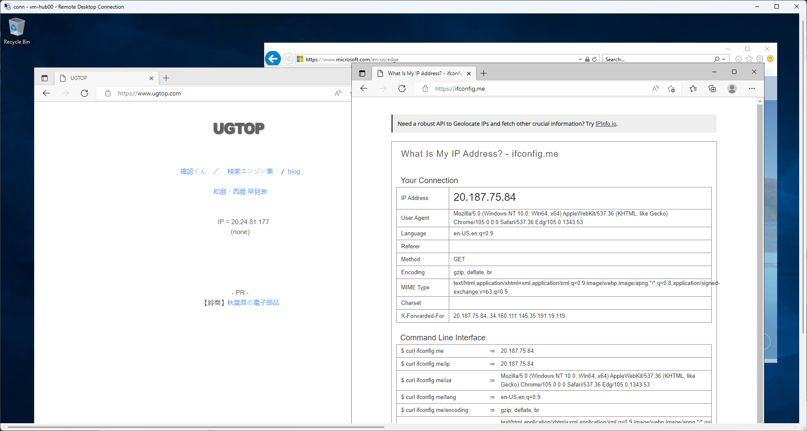
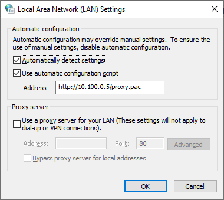

# Forced tunneling and proxy but Internet access directly from Azure

強制トンネリング環境で、オンプレミスに proxy があるけど、一部の通信を Azure からインターネットに直接出す。

# 前提条件

- 強制トンネリング環境
- オンプレミスに proxy がある
- バックアップのトラフィックなど、それなりに大きなトラフィックについては Azure からインターネットに出したい

# 構成のポイント

`cloud-init` でなるべく自動的に構成する
- 手動で設定が必要なのは Windows Server 側の pac file 参照の部分のみ

NVA と Azure Route Server (ARS) で強制トンネリング環境を作る
- 強制トンネリング環境を再現するため、オンプレミス環境を模した VNet 側に ARS を置く
- FRRouting を用いて NVA を構成し、`default-originate` を利用して `0.0.0.0/0` を経路広報する

proxy 兼 Web server を構築する
- オンプレミス環境の proxy は Squid で構築
- 同 server に nginx をインストールし、proxy.pac を公開する
- proxy.pac 上で、オンプレミス proxy に向けるものと、インターネットに直接出すものを分類する

client となる Windows Server の構成
- インターネットに直接出すものに関しては UDR (User Defined Route) で `0.0.0.0/0` を上書きしている (この subnet に関しては強制トンネリングが効いていない)

# `cloud-init` の自動構成の確認

proxy 兼 pac file 配布 server 役の vm-proxy100 が `cloud-init` で自動構成されていることを確認。

```
ikko@vm-proxy100:~$ sudo systemctl status squid
● squid.service - Squid Web Proxy Server
     Loaded: loaded (/lib/systemd/system/squid.service; enabled; vendor preset: enabled)
     Active: active (running) since Tue 2022-10-25 08:40:12 UTC; 17min ago
       Docs: man:squid(8)
   Main PID: 2555 (squid)
      Tasks: 4 (limit: 9530)
     Memory: 15.7M
     CGroup: /system.slice/squid.service
             ├─2555 /usr/sbin/squid -sYC
             ├─2557 (squid-1) --kid squid-1 -sYC
             ├─2571 (logfile-daemon) /var/log/squid/access.log
             └─2573 (pinger)

Oct 25 08:40:12 vm-proxy100 squid[2557]: Max Swap size: 0 KB
Oct 25 08:40:12 vm-proxy100 squid[2557]: Using Least Load store dir selection
Oct 25 08:40:12 vm-proxy100 squid[2557]: Set Current Directory to /var/spool/squid
Oct 25 08:40:12 vm-proxy100 squid[2557]: Finished loading MIME types and icons.
Oct 25 08:40:12 vm-proxy100 squid[2557]: HTCP Disabled.
Oct 25 08:40:12 vm-proxy100 squid[2557]: Pinger socket opened on FD 14
Oct 25 08:40:12 vm-proxy100 squid[2557]: Squid plugin modules loaded: 0
Oct 25 08:40:12 vm-proxy100 squid[2557]: Adaptation support is off.
Oct 25 08:40:12 vm-proxy100 squid[2557]: Accepting HTTP Socket connections at local=[::]:3128 remote=[::] FD 12 flags=9
Oct 25 08:40:13 vm-proxy100 squid[2557]: storeLateRelease: released 0 objects

ikko@vm-proxy100:~$ diff -u /etc/squid/squid.conf.org /etc/squid/squid.conf
--- /etc/squid/squid.conf.org   2022-09-23 12:07:31.000000000 +0000
+++ /etc/squid/squid.conf       2022-10-25 08:40:17.022101413 +0000
@@ -1404,7 +1404,7 @@
 # Example rule allowing access from your local networks.
 # Adapt localnet in the ACL section to list your (internal) IP networks
 # from where browsing should be allowed
-#http_access allow localnet
+http_access allow localnet
 http_access allow localhost

 # And finally deny all other access to this proxy

ikko@vm-proxy100:~$ sudo systemctl status nginx
● nginx.service - A high performance web server and a reverse proxy server
     Loaded: loaded (/lib/systemd/system/nginx.service; enabled; vendor preset: enabled)
     Active: active (running) since Tue 2022-10-25 08:40:13 UTC; 17min ago
       Docs: man:nginx(8)
   Main PID: 2629 (nginx)
      Tasks: 3 (limit: 9530)
     Memory: 5.4M
     CGroup: /system.slice/nginx.service
             ├─2629 nginx: master process /usr/sbin/nginx -g daemon on; master_process on;
             ├─2630 nginx: worker process
             └─2631 nginx: worker process

Oct 25 08:40:13 vm-proxy100 systemd[1]: Starting A high performance web server and a reverse proxy server...
Oct 25 08:40:13 vm-proxy100 systemd[1]: Started A high performance web server and a reverse proxy server.

ikko@vm-proxy100:~$ ls /var/www/html/
index.nginx-debian.html  proxy.pac
```

Azure Route Server (ARS) に対して強制トンネリング (forced tunneling) の役割を持つ vm-nva100 も `cloud-init` で自動構成されていることを確認。

```
ikko@vm-nva100:~$ sudo systemctl status frr
● frr.service - FRRouting
     Loaded: loaded (/lib/systemd/system/frr.service; enabled; vendor preset: enabled)
     Active: active (running) since Tue 2022-10-25 09:02:54 UTC; 22min ago
       Docs: https://frrouting.readthedocs.io/en/latest/setup.html
   Main PID: 3018 (watchfrr)
     Status: "FRR Operational"
      Tasks: 13 (limit: 9530)
     Memory: 22.2M
     CGroup: /system.slice/frr.service
             ├─3018 /usr/lib/frr/watchfrr -d -F traditional zebra bgpd staticd
             ├─3031 /usr/lib/frr/zebra -d -F traditional -A 127.0.0.1 -s 90000000
             ├─3036 /usr/lib/frr/bgpd -d -F traditional -A 127.0.0.1
             └─3043 /usr/lib/frr/staticd -d -F traditional -A 127.0.0.1

Oct 25 09:02:54 vm-nva100 watchfrr[3018]: [YFT0P-5Q5YX] Forked background command [pid 3019]: /usr/lib/frr/watchfrr.sh restart all
Oct 25 09:02:54 vm-nva100 zebra[3031]: [VTVCM-Y2NW3] Configuration Read in Took: 00:00:00
Oct 25 09:02:54 vm-nva100 bgpd[3036]: [VTVCM-Y2NW3] Configuration Read in Took: 00:00:00
Oct 25 09:02:54 vm-nva100 staticd[3043]: [VTVCM-Y2NW3] Configuration Read in Took: 00:00:00
Oct 25 09:02:54 vm-nva100 watchfrr[3018]: [QDG3Y-BY5TN] zebra state -> up : connect succeeded
Oct 25 09:02:54 vm-nva100 watchfrr[3018]: [QDG3Y-BY5TN] bgpd state -> up : connect succeeded
Oct 25 09:02:54 vm-nva100 watchfrr[3018]: [QDG3Y-BY5TN] staticd state -> up : connect succeeded
Oct 25 09:02:54 vm-nva100 watchfrr[3018]: [KWE5Q-QNGFC] all daemons up, doing startup-complete notify
Oct 25 09:02:54 vm-nva100 frrinit.sh[3008]:  * Started watchfrr
Oct 25 09:02:54 vm-nva100 systemd[1]: Started FRRouting.

ikko@vm-nva100:~$ sudo -s
root@vm-nva100:/home/ikko# vtysh

Hello, this is FRRouting (version 8.3.1).
Copyright 1996-2005 Kunihiro Ishiguro, et al.

vm-nva100# show ip bgp sum

IPv4 Unicast Summary (VRF default):
BGP router identifier 10.100.0.4, local AS number 65001 vrf-id 0
BGP table version 0
RIB entries 3, using 576 bytes of memory
Peers 2, using 1447 KiB of memory

Neighbor        V         AS   MsgRcvd   MsgSent   TblVer  InQ OutQ  Up/Down State/PfxRcd   PfxSnt Desc
10.100.210.4    4      65515        27        24        0    0    0 00:21:01            2        1 N/A
10.100.210.5    4      65515        27        23        0    0    0 00:20:59            2        1 N/A

Total number of neighbors 2
```

# クライアント目線での動作確認

https://ifconfig.me と https://www.ugtop.com でアクセス元の IP アドレスが異なっている。
それぞれ IP が異なって見えており、proxy 経由と直接接続の差となっている。



# 考慮点

結局強制トンネリングを回避している形になるため、NSG や追加の proxy を置くなどして何らかの制限を掛けることにはなると思う。

# FRRouting config sample

強制トンネリング環境を実現するため、`neighbor x.x.x.x default-originate` を利用している。

```
vm-nva100# show run
Building configuration...

Current configuration:
!
frr version 8.3.1
frr defaults traditional
hostname vm-nva100
log syslog informational
no ip forwarding
no ipv6 forwarding
service integrated-vtysh-config
!
ip route 10.100.210.0/24 10.0.0.1
!
router bgp 65001
 neighbor 10.100.210.4 remote-as 65515
 neighbor 10.100.210.4 ebgp-multihop 255
 neighbor 10.100.210.5 remote-as 65515
 neighbor 10.100.210.5 ebgp-multihop 255
 !
 address-family ipv4 unicast
  neighbor 10.100.210.4 default-originate
  neighbor 10.100.210.4 soft-reconfiguration inbound
  neighbor 10.100.210.4 route-map rmap-bogon-asns in
  neighbor 10.100.210.4 route-map rmap-azure-asns out
  neighbor 10.100.210.5 default-originate
  neighbor 10.100.210.5 soft-reconfiguration inbound
  neighbor 10.100.210.5 route-map rmap-bogon-asns in
  neighbor 10.100.210.5 route-map rmap-azure-asns out
 exit-address-family
exit
!
bgp as-path access-list azure-asns seq 5 permit _65515_
bgp as-path access-list bogon-asns seq 5 permit _0_
bgp as-path access-list bogon-asns seq 10 permit _23456_
bgp as-path access-list bogon-asns seq 15 permit _1310[0-6][0-9]_|_13107[0-1]_
bgp as-path access-list bogon-asns seq 20 deny _65515_
bgp as-path access-list bogon-asns seq 25 permit ^65
!
route-map rmap-bogon-asns deny 5
 match as-path bogon-asns
exit
!
route-map rmap-bogon-asns permit 10
exit
!
route-map rmap-azure-asns deny 5
 match as-path azure-asns
exit
!
route-map rmap-azure-asns permit 10
exit
!
end
```

強制トンネリングしている状態での `show ip bgp nei x.x.x.x adv` の結果。

```
vm-nva100# show ip bgp nei 10.100.210.4 advertised-routes
BGP table version is 0, local router ID is 10.100.0.4, vrf id 0
Default local pref 100, local AS 65001
Status codes:  s suppressed, d damped, h history, * valid, > best, = multipath,
               i internal, r RIB-failure, S Stale, R Removed
Nexthop codes: @NNN nexthop's vrf id, < announce-nh-self
Origin codes:  i - IGP, e - EGP, ? - incomplete
RPKI validation codes: V valid, I invalid, N Not found

Originating default network 0.0.0.0/0

```

# proxy.pac sample

[Example PAC File](https://findproxyforurl.com/example-pac-file/) を参考に適当に修正。
`ifconfig.me` に行くときには DIRECT、それ以外は proxy 経由とする。

```
ikko@vm-proxy100:~$ cat /var/www/html/proxy.pac
function FindProxyForURL(url, host) {
  if (dnsDomainIs(host, "ifconfig.me")) {
      return "DIRECT";
  }

  // DEFAULT RULE: All other traffic, use below proxies, in fail-over order.
  return "PROXY 10.100.0.5:3128";
}
```

Windows Server 側ではこのような設定、珍しいことは何もない。



# 参考

- Example PAC File | FindProxyForURL

  https://findproxyforurl.com/example-pac-file/

- Proxy Auto-Configuration (PAC) file - HTTP | MDN

  https://developer.mozilla.org/en-US/docs/Web/HTTP/Proxy_servers_and_tunneling/Proxy_Auto-Configuration_PAC_file
