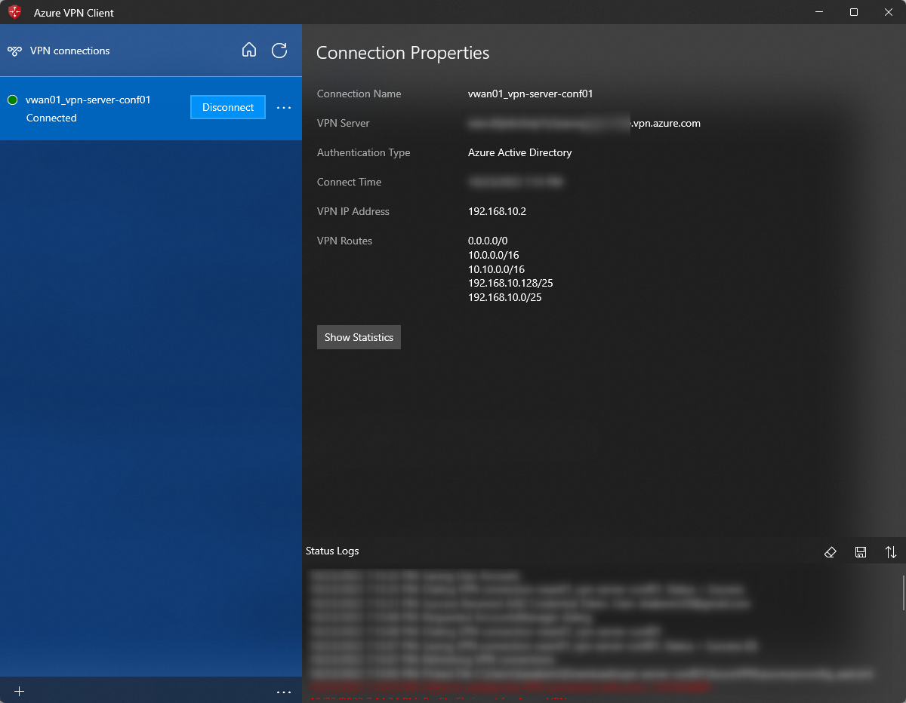

# P2S VPN for Azure Virtual WAN with Azure AD Authentication and connecting VNet

Azure AD 認証を用いた P2S VPN を Azure Virtual WAN で利用し、その先の VNet にある Azure VM へ接続する。

以下のテンプレートの少し発展形。

https://github.com/skmkzyk/bicep-templates/tree/main/20220930_hub-spoke-wo-remote-gw

# 構成のポイント

- Virtual WAN 関連のリソースを Bicep で作る、いろんなリソースを作る
- Secure hub にして Forced tunneling を有効化することで、P2S VPN で 0.0.0.0/0 が適用され、PC からインターネットに向かう通信も P2S VPN 経由にする
- シンプルにつないだだけだと 0.0.0.0/0 で吸い込めない可能性があり、その場合には規定のインターネット通信側の metric を手動で大きくする

# 結果

Virtual Hub (10.0.0.0/16) の先にある VNet (10.10.0.0/16) にある Azure VM (10.0.0.4) に直接接続ができている。

```shell
PS C:\Users\xxxxxxxx> ssh ikko@10.10.0.4
Welcome to Ubuntu 20.04.5 LTS (GNU/Linux 5.15.0-1022-azure x86_64)

 * Documentation:  https://help.ubuntu.com
 * Management:     https://landscape.canonical.com
 * Support:        https://ubuntu.com/advantage

  System information as of Sun Oct 23 11:42:07 UTC 2022

  System load:  0.23              Processes:             132
  Usage of /:   8.9% of 28.89GB   Users logged in:       0
  Memory usage: 10%               IPv4 address for eth0: 10.10.0.4
  Swap usage:   0%

 * Super-optimized for small spaces - read how we shrank the memory
   footprint of MicroK8s to make it the smallest full K8s around.

   https://ubuntu.com/blog/microk8s-memory-optimisation

8 updates can be applied immediately.
5 of these updates are standard security updates.
To see these additional updates run: apt list --upgradable

New release '22.04.1 LTS' available.
Run 'do-release-upgrade' to upgrade to it.


Last login: Sun Oct 23 11:42:04 2022 from 192.168.10.130
ikko@vm-hub00:~$ ip a
1: lo: <LOOPBACK,UP,LOWER_UP> mtu 65536 qdisc noqueue state UNKNOWN group default qlen 1000
    link/loopback 00:00:00:00:00:00 brd 00:00:00:00:00:00
    inet 127.0.0.1/8 scope host lo
       valid_lft forever preferred_lft forever
    inet6 ::1/128 scope host
       valid_lft forever preferred_lft forever
2: eth0: <BROADCAST,MULTICAST,UP,LOWER_UP> mtu 1500 qdisc mq state UP group default qlen 1000
    link/ether 00:22:48:15:e1:47 brd ff:ff:ff:ff:ff:ff
    inet 10.10.0.4/24 brd 10.10.0.255 scope global eth0
       valid_lft forever preferred_lft forever
    inet6 fe80::222:48ff:fe15:e147/64 scope link
       valid_lft forever preferred_lft forever
```

Azure VPN の画面上で確認できる経路一覧にも 10.10.0.0/16 が表示されている。


