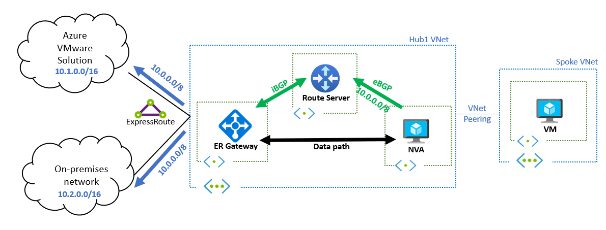

# Hairpin traffic by NVA & ARS for two branches connected by two different ExpressRoute circuits

これみたいなやつを実現する。
IP アドレス等は図に記載されているものから、自分の好みでかなり変えています。


[Azure VMware Solution へのルートの挿入 | Microsoft Learn](https://learn.microsoft.com/ja-jp/azure/route-server/vmware-solution-default-route#communication-between-azure-vmware-solution-and-the-on-premises-network-via-an-nva)

# 前提条件

- ExpressRoute circuit が 2 つある
- 拠点を想定した 2 つの VNet (10.100.0.0/16、10.200.0.0/16) の間で通信を確立させたい
- 普通に ExpressRoute を 1 つの ExpressRoute Gateway に接続してもその間での折り返し通信は実現しない
  - シンプルな実現方法としては ExpressRoute circuit 間で Global Reach を構成する、だが今回はそれ以外の方法をとる

# 構成のポイント

- Hub となる VNet で ARS + NVA の構成を作成する
  - NVA はいつもどおり FRRouting で構成
  - 構成は `cloud-init` である程度自動化
- NVA では各拠点等で広報される経路より less specific な経路 (すーぱーせっと) な経路を広報し、一旦トラフィックを引き込むようにする
- Hub の GatewaySubnet では UDR を関連付け、拠点向けトラフィックが一旦 NVA に来るようにする
  - NVA ではもちろん `enableIPForwarding` を `true` にする
  - OS 側でも forwarding を有効化する

FRRouting の config はこちら。

```
vm-hub00# show run
Building configuration...

Current configuration:
!
frr version 8.3.1
frr defaults traditional
hostname vm-hub00
log syslog informational
no ipv6 forwarding
service integrated-vtysh-config
!
ip route 10.0.210.0/24 10.0.0.1
!
interface lo
 ip address 10.0.0.1/8
exit
!
router bgp 65001
 neighbor 10.0.210.4 remote-as 65515
 neighbor 10.0.210.4 ebgp-multihop 255
 neighbor 10.0.210.5 remote-as 65515
 neighbor 10.0.210.5 ebgp-multihop 255
 !
 address-family ipv4 unicast
  network 10.0.0.0/8
  neighbor 10.0.210.4 soft-reconfiguration inbound
  neighbor 10.0.210.4 route-map rmap-bogon-asns in
  neighbor 10.0.210.4 route-map rmap-azure-asns out
  neighbor 10.0.210.5 soft-reconfiguration inbound
  neighbor 10.0.210.5 route-map rmap-bogon-asns in
  neighbor 10.0.210.5 route-map rmap-azure-asns out
 exit-address-family
exit
!
bgp as-path access-list azure-asns seq 5 permit _65515_
bgp as-path access-list bogon-asns seq 5 permit _0_
bgp as-path access-list bogon-asns seq 10 permit _23456_
bgp as-path access-list bogon-asns seq 15 permit _1310[0-6][0-9]_|_13107[0-1]_
bgp as-path access-list bogon-asns seq 20 deny _65515_
bgp as-path access-list bogon-asns seq 25 permit ^65
!
route-map rmap-bogon-asns deny 5
 match as-path bogon-asns
exit
!
route-map rmap-bogon-asns permit 10
exit
!
route-map rmap-azure-asns deny 5
 match as-path azure-asns
exit
!
route-map rmap-azure-asns permit 10
exit
!
end
```

大体は、[Azure Route Server と FRRouting の間で BGP ピアを張る](https://zenn.dev/skmkzyk/articles/azure-route-server-frrouting) に書いてあるのの焼き直しです。
ただ、[Azure ExpressRoute transit options](https://www.youtube.com/watch?v=x32SNdEaf-Q) を参考に、10.0.0.1/8 で loopback interface を作成し、`network 10.0.0.0 mask 255.0.0.0` を追加しています。
これにより、10.0.0.0/8 が経路広報され、2 つの ExpressRoute circuit でのヘアピンのためのトラフィックの引き込みを実現します。
これがないと、それぞれの拠点側にもう片方の拠点の経路が BGP で広報されないため、そもそもルーティング的に到達性がありません。

```
vm-hub00# show ip bgp nei 10.0.210.4 advertised-routes
BGP table version is 4, local router ID is 10.0.0.4, vrf id 0
Default local pref 100, local AS 65001
Status codes:  s suppressed, d damped, h history, * valid, > best, = multipath,
               i internal, r RIB-failure, S Stale, R Removed
Nexthop codes: @NNN nexthop's vrf id, < announce-nh-self
Origin codes:  i - IGP, e - EGP, ? - incomplete
RPKI validation codes: V valid, I invalid, N Not found

   Network          Next Hop            Metric LocPrf Weight Path
*> 10.0.0.0/8       0.0.0.0                  0         32768 i

Total number of prefixes 1
```

# 結果


10.100.0.4 -> 10.200.0.4 の [Microsoft/Ethr](https://github.com/Microsoft/Ethr) での TCP traceroute の結果はこちら。

```shell
ikko@vm-hub100:~$ sudo ./ethr -c 10.200.0.4 -p tcp -port 22 -t tr

Ethr: Comprehensive Network Performance Measurement Tool (Version: v1.0.0)
Maintainer: Pankaj Garg (ipankajg @ LinkedIn | GitHub | Gmail | Twitter)

Using destination: 10.200.0.4, ip: 10.200.0.4, port: 22
Tracing route to 10.200.0.4 over 30 hops:
 1.|--10.0.200.12 []                                                         92.622ms
 2.|--10.0.0.4 []                                                            97.924ms
 3.|--???
 4.|--10.200.0.4 []                                                          184.002ms
Ethr done, measurement complete.
```

なぜか ExpressRoute Gateway から ICMP 帰ってきてるように見える。
それから、NVA である 10.0.0.4 を経由している様子が見える。

逆の方向はこちら。

```shell
ikko@vm-hub200:~$ sudo ./ethr -c 10.100.0.4 -p tcp -port 22 -t tr

Ethr: Comprehensive Network Performance Measurement Tool (Version: v1.0.0)
Maintainer: Pankaj Garg (ipankajg @ LinkedIn | GitHub | Gmail | Twitter)

Using destination: 10.100.0.4, ip: 10.100.0.4, port: 22
Tracing route to 10.100.0.4 over 30 hops:
 1.|--10.0.200.12 []                                                         90.838ms
 2.|--10.0.0.4 []                                                            88.059ms
 3.|--???
 4.|--10.100.0.4 []                                                          188.711ms
Ethr done, measurement complete.
```

特に変わった点は無し。

# 考慮点

NVA シングル構成のため、本来は 2 台構成して LB おいて、NEXT_HOP 属性を利用したりする、はず。

# 参考

- [Azure Route Server と FRRouting の間で BGP ピアを張る](https://zenn.dev/skmkzyk/articles/azure-route-server-frrouting]
- [Azure ExpressRoute transit options](https://www.youtube.com/watch?v=x32SNdEaf-Q)
- [Microsoft/Ethr](https://github.com/Microsoft/Ethr)